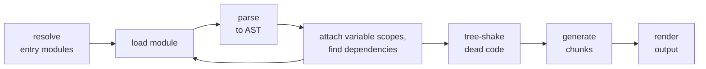

# Rollup Reloaded

## A Journey into Rust, WebAssembly, and High-Speed Bundling

---
layout: section
sectionNumber: '1'
---

# JavaScript Bundlers

<!--
Who is using Rollup? Who is using Vite? And who is maintaining their own JavaScript bundler?
-->

---

# JavaScript Bundlers

<div v-click>

(a small selection)

</div>
<v-click>

Browserify, Webpack, Rollup, Vite, Snowpack, Parcel, esbuild, swc, Rolldown, farm, Rspack, Bun.build, Turbopack

</v-click>

<v-click>

(most of them are blazingly fast)

</v-click>

---

# Rollup

<div v-click>(not blazingly fast)</div>

<v-click>

## The Rise of Rollup

</v-click>
<v-clicks>

* 2015: Created by Rich Harris
* 2017: Maintained by me
* Main tool for bundling libraries
* 2020: Vite chooses Rollup for its production build
  * Adds everything missing for the web
  * Great developer experience

</v-clicks>

---

# Where Rollup Sucks

<v-click>

## Main issue 1: Memory consumption
* Tree-shaking requires all modules in memory
* Solution would require paging
* Would be complex and slow

</v-click>
<v-click>

## Main issue 2: Performance

</v-click>

---

# A Bold New Strategy

<v-clicks>

* February 2023: Start to move core parts to Rust
* July 2023: PR opened
  
* August 2023: Evan You contacts me
  
* Goal: Rewrite Rollup in Rust, no interest in my incremental approach

</v-clicks>

---
layout: statement
---

I do not believe in rewrites.

---
layout: section
sectionNumber: '2'
---

# Rust

---

# Options for native code

<v-click>

## C/C++

* Great Node support, powerful
* Difficult memory management, easy to mess up

</v-click>
<v-click>

## Zig

* Used by bun
* Tooling support and ecosystem still lacking

</v-click>
<v-click>

## Go

* Used by esbuild
* Solid choice, JS interop likely not as mature

</v-click>
<v-click>

## Rust

* Great ecosystem for JS interop, can build upon SWC
* Innovative memory management via ownership

</v-click>

---

# Ownership

```rust {1-3|6|1-3,7|8|9|6-7,10|all}
struct Container {
    data: String
}

fn main() {
    let hello = String::from("Hello");
    let mut container = Container { data: hello };
    container.data.push_str(" World");
    println!("{}", container.data);
    println!("{}", hello); // ❌ value has been "moved" to "container"
}
```

<v-clicks>

* Every value is "owned" by a variable binding.
* Ownership is transferred on assignment or function call.
* Memory is freed when the owner goes out of scope.

</v-clicks>

---

# Borrowing

```rust {1-3|6|1-3,7-8|9|10-11|12|all}
struct Container<'a> {
    data: &'a mut String,
}

fn main() {
    let mut hello = String::from("Hello");
    // begin borrow/lifetime a
    let container = Container { data: &mut hello };
    container.data.push_str(" World");
    println!("{}", container.data);
    // end borrow/lifetime a after last use
    println!("{}", hello); // cannot happen before last container usage
}
```

<v-clicks>

* Values can be "borrowed" via references (= pointers)
* References have lifetimes controlled by their usage
* At most one mutable reference at a time, or multiple immutable ones
* Avoids data races

</v-clicks>

---
layout: statement
---

Rust is great for performant, safe, and concurrent software.

---
layout: section
sectionNumber: '3'
---

# Native Binaries in Node

---

# Native Node Modules

<v-clicks>

* `.node` files (actually a renamed `.so`, `.dylib` or `.dll` depending on OS)
* Only usable via `require`
* Traditionally created via `node-gyp` from C++, recompiled for every Node version
* Since Node 8: Node-API (N-API) as stable interface
  * Binaries work across Node versions
  * Need to match OS and CPU architecture

</v-clicks>

---

# Abstracting the interface away<br>with NAPI-RS

<div style="display:flex;flex-direction: row;gap: 20px;">

<div>

Powerful macros and types to generate the JavaScript interface

```rust {all|5-8}
use napi::bindgen_prelude::Buffer;
use napi_derive::napi;
use parse_ast::parse_ast;

#[napi]
pub fn parse(code: String, allow_return_outside_function: bool) -> Buffer {
  parse_ast(code, allow_return_outside_function).into()
}
```

<v-click>

Auto-generated types

```typescript
export function parse(code: string, allowReturnOutsideFunction: boolean): Buffer
```

</v-click>

</div>
</div>

<v-click>

Similar to `node-bindgen`, but more efficient generated code and powerful tooling.

</v-click>

---

# How to publish across platforms

Set up by NAPI-RS CLI tool

<v-clicks>

* separate packages for every target
  ```
  @rollup/rollup-win32-x64-msvc
  @rollup/rollup-darwin-arm64
  ...
  ```
  * contain `.node` file as entry point
  * list `os` and `cpu` in their `package.json` file
* `rollup` package has __all__ platform packages as `optionalDependencies`
  * Node only installs suitable packages
* NAPI-RS scaffolds GitHub Actions to build for many platforms
  * Rollup supports 16 targets: 3 Windows, 2 Mac, 2 Android, 9 Linux

</v-clicks>

---

# For Browsers: WebAssembly

* Portable binary format
* Supported in all modern browsers and NodeJS >= 8
* Some parsing overhead

<v-click>

## One-stop solution: wasm-pack

</v-click>

<div style="display:flex;flex-direction: row;gap: 20px;">

<div>

<v-click>

Very similar to NAPI-RS

```rust
use parse_ast::parse_ast;
use wasm_bindgen::prelude::wasm_bindgen;

#[wasm_bindgen]
pub fn parse(code: String, allow_return_outside_function: bool) -> Vec<u8> {
  parse_ast(code, allow_return_outside_function)
}
```

</v-click>
<v-clicks>

* Includes TypeScript type generation
* For both Node and browser targets

</v-clicks>

</div>
</div>

---
layout: section
sectionNumber: '4'
---

# Incremental Migration

## —the data transfer problem

---

# Rollup Build Pipeline



<v-click>

## Slowest steps

* parsing: handled by acorn
* tree-shaking

</v-click>
<v-click>

## Migration

* Replace acorn with SWC, release
* Then gradually move analysis and tree-shaking to Rust

</v-click>

---

# Data Transfer

## JSON AST is slow

<v-clicks>

- Parse via acorn in JS: 180ms
- Parse via SWC in Rust: 51ms
- Parse via SWC and transfer via JSON: 270ms

</v-clicks>
<v-click>

## Transfer binary data?

</v-click>
<v-clicks>

- ArrayBuffers provide no-copy transfer to native modules, WebAssembly, workers
- Pre-made solution: MessagePack 

</v-clicks>
<v-click>

## But I wrote my own

</v-click>

---

# The Binary AST

<div>Heavily relies on generated code.</div>
<p><v-clicks>

- AST definitions
  ```javascript
  const AST_NODES = {
    ArrayExpression: {
      fields: [['elements', 'NodeList']]
    }, // ...
  };
  ```
- JavaScript decoder
    ```typescript
    const nodeConverters = [
      (position: number, buffer: Uint32Array) => ({
        type: 'ArrayExpression', start: buffer[position], end: buffer[position + 1],
        elements: convertNodeList(buffer[position + 2], buffer)
      }), // ...
    ];
    ```

</v-clicks></p>
<v-click>
Node types are encoded as numbers, correspond to array indices for fast access.
</v-click>

---

## The Binary AST

<div>Rust macros encapsulate indices and positions</div>
<p><v-click>

```rust
store_array_expression!(
  self,
  span => array_literal.span,
  elements => [array_literal.elems, convert_expression_or_spread]
);
```

</v-click></p>
<v-click>

<div>In the future</div>

* Directly operate on buffer in Rust
* Encapsulate prop access via `proc_macro_attribute`.

```rust
#[decode_array_expression]
fn array_expression_has_effects(position: usize, buffer: &Buffer) -> bool {
  has_list_node_effect(node.elements, buffer)
}
```

</v-click>

---

# How much did we gain?

Original parse time via acorn in JS: 180ms

<v-clicks>

- Parse via SWC in Rust: 51ms
- Serialize in Rust: 8ms
- Deserialize in JavaScript: 47ms

</v-clicks>
<v-click>

Total parse time including conversion: 108ms

</v-click>
<v-click>

## What about multi-threading?

</v-click>
<v-click>

- JavaScript workers are very slow to instantiate
- However, POSIX threads in Rust are nearly free

</v-click>
<v-click>

For non-WebAssembly, only the decode time is relevant<br>
—which can be eliminated if JS directly works on the buffer as well.

</v-click>

---

# Will this be needed forever?

<v-clicks>

* Well-optimized parts may never be moved to Rust
* Working on the buffer allows fast caching/paging
* JavaScript plugins need access to AST
  * Provide an API to lazily generate AST nodes from the buffer
  * Provide an API to walk the AST on the buffer, generate AST nodes only when needed

</v-clicks>
<p>
<div v-click>☞ Apparently, nobody has done that before.</div>
<div v-click>☞ Deno engineers showed great interest if I could extract this.</div>
</p>

---
layout: section
sectionNumber: '5'
---

# A Future with Vite?

---

# How it continued

<v-clicks>

* August 2023: Evan You offers to pay me as a consultant to support Rolldown
* October 2023: I propose to make Rolldown the next Rollup version if it can fully replace it
* March 2024: Finally started offering workshops at TNG to work on Rollup
* Never heard back from Evan You or the Rolldown team, but…
* April 2024: Contacted by patak from Vite
  * The Rolldown team never watched my talk
  * They perceived the relationship "differently"

</v-clicks>
<p>
<div v-click>☞ I will keep focusing on Rollup. Let's see when they match output size.</div>
<div v-click>☞ They should probably talk to me if they want to align on API development.</div>
</p>

---
layout: statement
---

The End?

