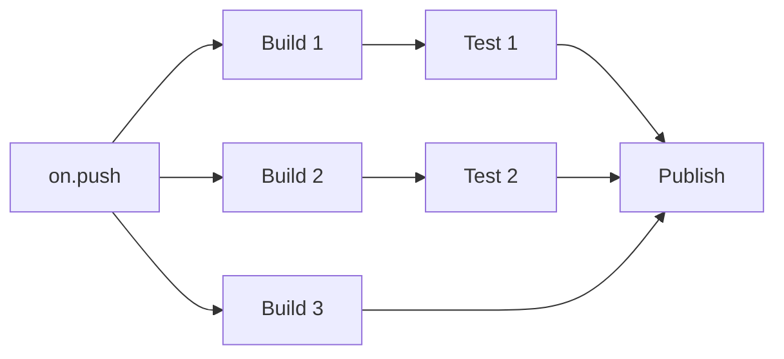

# Rollup Reloaded

## A Journey into Rust, WebAssembly, and High-Speed Bundling

---
layout: section
sectionNumber: 1
---

# Open Source

---
layout: section
sectionNumber: 2
---

# Rust

---

# Options for native code

## C/C++

* Great Node support, powerful
* Difficult memory management, easy to mess up

## Zig

* Used by bun
* Tooling support and ecosystem still lacking

## Go

* Used by esbuild
* Solid choice, JS interop likely not as mature

## Rust

* Great ecosystem for JS interop
* Innovative memory management via ownership

---

# Ownership

```rust {1-3|6|1-3,7|8|9|6-7,10|all}
struct Container {
    data: String
}

fn main() {
    let hello = String::from("Hello");
    let mut container = Container { data: hello };
    container.data.push_str(" World");
    println!("{}", container.data);
    println!("{}", hello); // ❌ value has been "moved" to "container"
}
```

<v-clicks>

* Every value is "owned" by a variable binding.
* Ownership is transferred on assignment or function call.
* Memory is freed when the owner goes out of scope.

</v-clicks>

---

# Borrowing

```rust {1-3|6|1-3,7-8|9|10-11|12|all}
struct Container<'a> {
    data: &'a mut String,
}

fn main() {
    let mut hello = String::from("Hello");
    // begin borrow/lifetime a
    let container = Container { data: &mut hello };
    container.data.push_str(" World");
    println!("{}", container.data);
    // end borrow/lifetime a after last use
    println!("{}", hello); // cannot happen before last container usage
}
```

<v-clicks>

* Values can be "borrowed" via references (= pointers)
* References have lifetimes controlled by their usage
* At most one mutable reference at a time, or multiple immutable ones
* Avoids data races

</v-clicks>

---
layout: statement
---

Rust is great for performant, safe, and concurrent software.

---
layout: section
sectionNumber: 3
---

# Native Binaries in Node

---

# Native Node Modules

<v-clicks>

* `.node` files (actually a renamed `.so`, `.dylib` or `.dll` depending on OS)
* Only usable via `require`
* Traditionally created via `node-gyp` from C++, recompiled for every Node version
* Since Node 8: Node-API (N-API) as stable interface
  * Binaries work across Node versions
  * Need to match OS and CPU architecture

</v-clicks>

---

# Abstracting the interface away<br>with NAPI-RS

<div style="display:flex;flex-direction: row;gap: 20px;">

<div>

Powerful macros and types to generate the JavaScript interface

```rust {all|5-8}
use napi::bindgen_prelude::Buffer;
use napi_derive::napi;
use parse_ast::parse_ast;

#[napi]
pub fn parse(code: String, allow_return_outside_function: bool) -> Buffer {
  parse_ast(code, allow_return_outside_function).into()
}
```

<v-click>

Auto-generated types

```typescript
export function parse(code: string, allowReturnOutsideFunction: boolean): Buffer
```

</v-click>

</div>
</div>

<v-click>

Similar to `rust-bindgen`, but more efficient generated code and powerful tooling.

</v-click>

---

# How to publish across platforms

Set up by NAPI-RS CLI tool

<v-clicks>

* separate packages for every target
  ```
  @rollup/rollup-win32-x64-msvc
  @rollup/rollup-darwin-arm64
  ...
  ```
  * contain only `.node` file as entry point
  * list `os` and `cpu` in their `package.json` file
* `rollup` package has __all__ platform packages as `optionalDependencies`
  * Node only installs suitable packages

</v-clicks>

---

# Building binaries for ALL platforms

<v-clicks>

* Not very feasible on a local machine
* `npx @napi-rs/cli new` scaffolds project with GitHub Actions to build for many platforms

</v-clicks>

<v-after>



</v-after>

<v-clicks>

By building on this, Rollup currently supports 16 targets  
→ 3 Windows, 2 Mac, 2 Android, 9 Linux

Learning:
For a server, just build a docker container instead of publishing,  
but probably avoid Alpine/musl libc

</v-clicks>

---
layout: statement
---

What about browser targets?

---
layout: section
sectionNumber: 4
---

# Web Assembly

---
layout: section
sectionNumber: 5
---

# Incremental Migration

## —the data transfer problem

---


