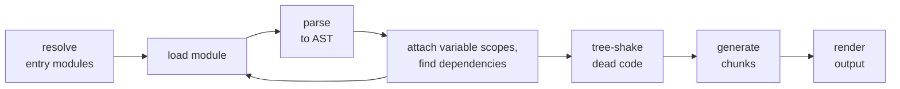

<p></p>

# Rollup Reloaded

## A Journey into Rust, WebAssembly, and High-Speed Bundling

<div style="margin:100px auto 0">

Dr. Lukas Taegert-Atkinson<br>
TNG Technology Consulting

</div>
<div style="margin: 24px auto">

Maintainer of RollupJS

</div>

<p style="margin: auto"></p>

---
layout: section
sectionNumber: '1'
transition: slide-left
---

<script setup>
const background = `linear-gradient(#0006, #000b),url('${import.meta.env.BASE_URL}img/backgrounds/reinventing-rollup.jpeg')`
</script>

<style scoped>
:deep(.bg-standout) {
    background-image: v-bind(background);
    background-position: 70% 78%;
    background-size: 250%;
}
</style>

# JavaScript Bundlers

<!--
Who is using Rollup? Who is using Vite? And who is maintaining their own JavaScript bundler?
-->

---

# JavaScript Bundlers

<style>
.bundler-logo {
    height: 70px;
}

.slidev-vclick-prior .bundler-logo,
.slidev-vclick-current .bundler-logo {
    animation: appear 1s both;
}

@keyframes appear {
    0% {
        opacity: 0;
    }
    100% {
        opacity: 1;
    }
}
</style>

<div>(a small selection)</div>
<v-click>

<div style="display:flex;flex-direction: row;gap: 20px;flex-wrap: wrap">


</div>

</v-click>


<v-click>

(most of them are blazingly fast)

</v-click>

---

<div style="display: flex;margin-bottom:30px;">

<div>

# Rollup

<div>(not blazingly fast)</div>
</div></div>

<v-clicks>

* 2015: Created by Rich Harris
* 2017: Maintained by me
* Main tool for bundling libraries
* 2020: Vite chooses Rollup for its production build
  * Adds everything missing for the web
  * Great developer experience

</v-clicks>

<!--
Just think of the xz backdoor
-->

---

# Popularity


---
transition: slide-left
---

# Where Rollup Sucks

<v-click>

## Main issue 1: Memory consumption
* Tree-shaking requires all modules in memory
* Solution would require paging
* Would be complex and slow

</v-click>
<v-click>

## Main issue 2: Performance

</v-click>

---

# Fixing Rollup

<v-clicks>

* February 2023: Start to move core parts to Rust
* July 2023: PR opened
  
* August 2023: Evan You contacts me
  
* Goal: Rewrite Rollup in Rust, no interest in my incremental approach

</v-clicks>

---
layout: statement
transition: slide-left
---

I do not believe in rewrites

---
layout: section
sectionNumber: '2'
transition: slide-left
---

<script setup>
const background = `linear-gradient(#0006, #000b),url('${import.meta.env.BASE_URL}img/backgrounds/reinventing-rollup.jpeg')`
</script>

<style scoped>
:deep(.bg-standout) {
    background-image: v-bind(background);
    background-position: 5% 5%;
    background-size: 250%;
}
</style>

# Incremental Migration

---

# Rollup Build Pipeline



<v-click>

## Slowest steps

* parsing: handled by acorn
* tree-shaking

</v-click>
<v-click>

## Migration

* Replace acorn with a native solution, release
* Then gradually move analysis and tree-shaking to native code

</v-click>

---
transition: slide-left
---

# Options for native code

<v-click>

## C/C++

* Great Node support, powerful
* Difficult memory management, easy to mess up

</v-click>
<v-click>

## Zig

* Used by bun
* Tooling support and ecosystem still lacking

</v-click>
<v-click>

## Go

* Used by esbuild
* Solid choice, JS interop likely not as mature

</v-click>
<v-click>

## <span v-mark="{ at: 5, color: '#000', type: 'circle' }">Rust</span>

* Innovative memory management
* Great ecosystem for JS interop, can build upon SWC's parser


</v-click>

---

# Native Node Modules

<v-clicks>

* `.node` files (actually a renamed `.so`, `.dylib` or `.dll` depending on OS)
* Only usable via `require`
* Traditionally created via `node-gyp` from C++, recompiled for every Node version
* Since Node 8: Node-API (N-API) as stable interface
  * Binaries work across Node versions
  * Need to match OS and CPU architecture

</v-clicks>

---

# Abstracting the interface away<br>with NAPI-RS

<div style="display:flex;flex-direction: row;gap: 20px;">

<div>

Powerful macros and types to generate the JavaScript interface

```rust {all|5-8}
use napi::bindgen_prelude::Buffer;
use napi_derive::napi;
use parse_ast::parse_ast;

#[napi]
pub fn parse(code: String, allow_return_outside_function: bool) -> Buffer {
  parse_ast(code, allow_return_outside_function).into()
}
```

<v-click>

Auto-generated types

```typescript
export function parse(code: string, allowReturnOutsideFunction: boolean): Buffer
```

</v-click>

</div>
</div>

<v-click>

Similar to `node-bindgen`, but more efficient generated code and powerful tooling.

</v-click>

---

# How to publish across platforms

## Set up by NAPI-RS CLI tool

<v-clicks>

* separate packages for every target
  ```
  @rollup/rollup-win32-x64-msvc
  @rollup/rollup-darwin-arm64
  ...
  ```
  * contain `.node` file as entry point
  * list `os` and `cpu` in their `package.json` file
* `rollup` package has __all__ platform packages as `optionalDependencies`
  * Node only installs suitable packages
* NAPI-RS scaffolds GitHub Actions to build for many platforms
  * Rollup supports 16 targets: 3 Windows, 2 Mac, 2 Android, 9 Linux

</v-clicks>

---
transition: slide-left
---

# For Browsers: WebAssembly

* Portable binary format
* Supported in all modern browsers and NodeJS >= 8

<v-click>

## One-stop solution: wasm-pack

</v-click>

<div style="display:flex;flex-direction: row;gap: 20px;">

<div>

<v-click>

Very similar to NAPI-RS

```rust
use parse_ast::parse_ast;
use wasm_bindgen::prelude::wasm_bindgen;

#[wasm_bindgen]
pub fn parse(code: String, allow_return_outside_function: bool) -> Vec<u8> {
  parse_ast(code, allow_return_outside_function)
}
```

</v-click>
<v-clicks>

* Includes TypeScript type generation
* For both Node and browser targets

</v-clicks>

</div>
</div>

---
layout: section
sectionNumber: '3'
transition: slide-left
---

<script setup>
const background = `linear-gradient(#0006, #000b),url('${import.meta.env.BASE_URL}img/backgrounds/reinventing-rollup.jpeg')`
</script>

<style scoped>
:deep(.bg-standout) {
    background-image: v-bind(background);
    background-position: 50% 25%;
    background-size: 300%;
}
</style>

# The Data Transfer Problem

---

# Data Transfer

## Transferring a JSON syntax tree is slow

<v-clicks>

- Parse via acorn in JS: 180ms
- Parse via SWC in Rust: 51ms
- Parse via SWC and transfer via JSON: 270ms

</v-clicks>
<v-click>

## Transfer binary data?

</v-click>
<v-clicks>

- ArrayBuffers provide no-copy transfer to native modules, WebAssembly, workers
- Pre-made solution: MessagePack 

</v-clicks>
<v-click>

## But I wrote my own

</v-click>

---

# Binary AST

<div>Heavily relies on generated code.</div>

<v-click>

## AST definitions

```javascript
const AST_NODES = {
  ArrayExpression: {
    fields: [
      ['elements', 'NodeList']
    ]
  },
  AssignmentPattern: {
    fields: [
      ['left', 'Node'],
      ['right', 'Node']
    ]
  }
  // ...
};
```

</v-click>

---

## Generated JavaScript decoder

<v-clicks>

- Convert single node
  ```typescript
  const convertNode = (position: number, buffer: Uint32Array) => {
    const type = buffer[position];
    return nodeConverters[type](position + 1, buffer);
  };
  ```
- Node types are encoded as numbers, correspond to array indices for fast access
  ```typescript
  const nodeConverters = [
    (position, buffer) => ({
      type: 'ArrayExpression',
      start: buffer[position],
      end: buffer[position + 1],
      elements: convertNodeList(buffer[position + 2], buffer)
    }), // ...
  ];
  ```

</v-clicks>

---
transition: slide-left
---

## Generated Rust macros

<div>Encapsulate indices and positions.</div>

<v-click>

```rust {1-4|6-14|8-12|all}
pub struct AstConverter<'a> {
  pub buffer: Vec<u8>,
  pub index_converter: Utf8ToUtf16ByteIndexConverterAndAnnotationHandler<'a>,
}

impl<'a> AstConverter<'a> {
  pub fn store_array_expression(&mut self, array_literal: &ArrayLit) {
    store_array_expression!(
      buffer,
      span => array_literal.span,
      elements => [array_literal.elems, convert_expression_or_spread]
    );
  }
}
```

</v-click>

---

# How much did we gain?

Original parse time via acorn in JS: 180ms

<v-clicks>

- Parse via SWC in Rust: 51ms
- Serialize in Rust: 8ms
- Deserialize in JavaScript: 47ms

</v-clicks>
<v-click>

Total parse time including conversion: 108ms.<br>
Serialize + deserialize 4 times faster than JSON.

</v-click>
<v-click>

## What about multi-threading?

</v-click>
<v-click>

- JavaScript workers are very slow to instantiate
- However, POSIX threads in Rust are nearly free

</v-click>
<v-click>

For non-WebAssembly, only the decode time is relevant<br>
—which can be eliminated if JS directly works on the buffer as well.

</v-click>

---

# The future architecture

<v-click>

## ☞ Stick with the buffers

</v-click>
<v-clicks>

* Well-optimized parts may never be moved to Rust
* Working on the buffer allows fast caching/paging
* Could easily replace SWC with an even faster parser like OXC

</v-clicks>
<v-click>

In Rust: Encapsulate Rust property access via `proc_macro_attribute`.
```rust
#[decode_array_expression]
fn array_expression_has_effects(position: usize, buffer: &AstBuffer) -> bool {
  has_list_node_effect(node.elements, buffer)
}
```

</v-click>

---
transition: slide-left
---

# JavaScript plugins remain first class citizens

## Provide an API for performant AST access

<v-clicks>

- walk the AST on the buffer
- generate AST nodes only when needed
- generate child nodes lazily via getters

</v-clicks>
<p></p>

<div v-click>☞ Apparently, nobody has done that before.</div>
<div v-click>☞ Deno engineers showed great interest if I could extract this.</div>

---
layout: section
sectionNumber: '4'
transition: slide-left
---

<script setup>
const background = `linear-gradient(#0006, #000b),url('${import.meta.env.BASE_URL}img/backgrounds/reinventing-rollup.jpeg')`
</script>

<style scoped>
:deep(.bg-standout) {
    background-image: v-bind(background);
    background-position: 40% 50%;
    background-size: 250%;
}
</style>

# A Future with Vite?

---

# How it continued

<v-clicks>

* August 2023: Evan You offers to pay me as a consultant to support Rolldown
* October 2023: I propose to make Rolldown the next Rollup version if it can fully replace it
* March 2024: Finally started offering workshops at TNG to work on Rollup
* Never heard back from Evan You or the Rolldown team, but…
* April 2024: Contacted by patak from Vite
  * The Rolldown team never watched my talk
  * They perceived the relationship "differently"

</v-clicks>

<p></p>

<div v-click>☞ I will keep focusing on Rollup. Let's see when they match output size.</div>
<div v-click>☞ They should probably talk to me if they want to align on API development.</div>

---
layout: fullsize-image
class: text-center
background: img/backgrounds/reinventing-rollup.jpeg
---

# Thank you

Dr. Lukas Taegert-Atkinson<br>
TNG Technology Consulting

<div style="margin:96px auto 24px">

<a href="https://m.webtoo.ls/@lukastaegert"><logos-mastodon-icon /> @lukastaegert@webtoo.ls</a>

<a href="https://rollupjs.org/"><logos-rollup/> rollupjs.org</a>

slides: <a href="https://lukastaegert.github.io/btd-rollup-2024">lukastaegert.github.io/btd-rollup-2024</a>

</div>

<p style="margin: auto"></p>

